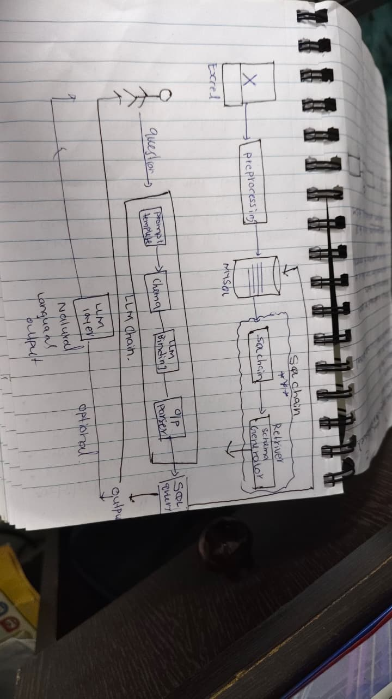

# Text_TO_SQL_LLM_chatbot Project
## A complete end‑to‑end Text‑to‑SQL Chatbot using LLM (Gemini / LangChain), MySQL database, and Excel‑based enterprise datasets.
## This README includes:
## * Project overview
## * Architecture diagram (hand‑drawn images included)
## * Steps followed in the project
## * ER diagram
## * Techniques used
## * Pipeline explanation
## * System workflow

# Project Overview
## This project converts natural language questions into SQL queries using an LLM, retrieves data from a MySQL database, and optionally converts the result back to human‑friendly natural language.
## The system simulates a SQL chatbot for business analytics, capable of querying multiple Excel‑based datasets such as:
## * Sales
## * Orders
## * Revenue
## * Budgeting
## * Customer data
## * Product information

# Key Features
## 🔹 Upload multiple Excel sheets
## 🔹 Preprocess and load them into MySQL database
## 🔹 Schema understanding using LangChain
## 🔹 LLM‑powered SQL generation
## 🔹 SQL execution & result retrieval
## 🔹 Optional natural language output generation

# Project Steps
## Below are the steps exactly referencing your notebook notes:
## 1. Have multiple Excel sheets like Sales, Orders, Revenue, Budgeting, etc.
## 2. Load the Excel sheets and create database tables in MySQL Workbench.
## 3. Analyze column labels and prepare possible business questions.
## 4. Setup code for connecting LLM to the database.
## 5. Build a pipeline to test the LLM model on questions.
## 6. Experiment with LLM settings; adjust model parameters.
## 7. Analyze model response using various metrics.
## 8. Fine‑tune prompts for better SQL accuracy and responses.

# Image(Detailed Architecture Flow)
## ##  Architecture Diagram

## 🔹 Full Flow Explanation
### 1. User asks a natural language question.
### 2. LLM Chain processes question using prompt template.
### 3. LLM analyzes schema + question.
### 4. SQL Query is generated.
### 5. Query is executed on MySQL DB.
### 6. Results are returned.
### 7. (Optional) Convert SQL output into natural language.

##  ER Diagram

## 🔹 Tables Involved
### * Customer Table
### * Products Table
### * Orders Table (central fact table)
### * State / Region Table
### * 2017 Budget Table
## Relationships (from diagram)
### * Customer ↔ Orders (1‑to‑Many)
### * Products ↔ Orders (1‑to‑Many)
### * Orders ↔ Region (Foreign key)
### * Budget ↔ Products

## LLM Processing Pipeline
## Input → Prompt Template → LLM → Output Parser → SQL
### *  Prompt Template: Contains schema + user question.
### * Gemini Model: Generates SQL.
### * Output Parser: Ensures only SQL is returned.
### * SQL Execution: Connects to MySQL.

## Output Example
### User:
"Show total revenue for 2023 by region"
LLM Output: "SELECT region, SUM(revenue) FROM sales GROUP BY region;"

🔹 End‑to‑end architecture using LangChain chains
